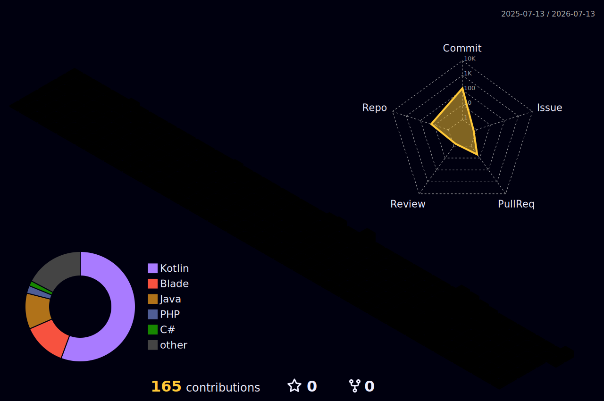

# Hi, I'm Arka 👋

An Android developer focused on building clean, efficient, and modern mobile apps using Kotlin and Jetpack Compose.

---

### Languages


### Frameworks & UI


### Concurrency & Network


### Database & Cloud


### Tools & Environment


---

### Coding Activity

[](https://wakatime.com/@d27f8261-bf3b-4bbd-aaf4-4f5e664b5184)

<!--START_SECTION:waka-->

```txt
From: 21 June 2026 - To: 21 July 2026

Total Time: 17 hrs 6 mins

Kotlin                 15 hrs 42 mins        >>>>>>>>>>>>>>>>>>>>>>>==   91.81 %
TypeScript             15 mins               =========================   01.52 %
XML                    15 mins               =========================   01.51 %
TOML                   13 mins               =========================   01.30 %
Java Properties        11 mins               =========================   01.16 %
```

<!--END_SECTION:waka-->

---

### Contribution Graph




---

### Connect

[](https://instagram.com/buervm)
[](https://discord.com/users/kaaves_95929)
[](mailto:arkamudya.aceananda@gmail.com)

> Some details here may change as I continue developing my skills and refining my projects.
