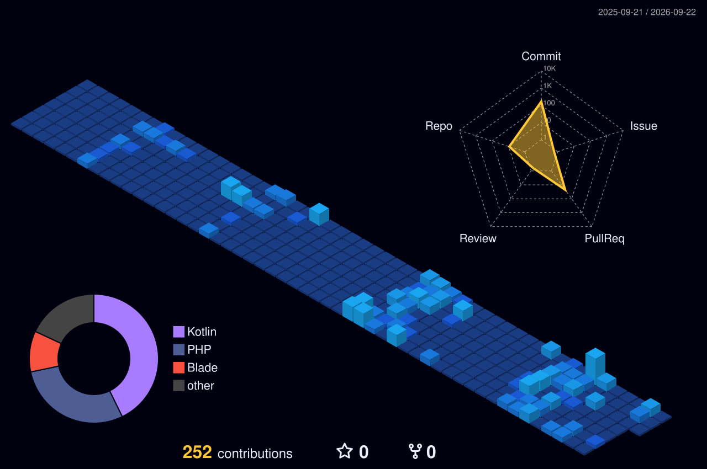

# Hi, I'm Arka 

Software and Game Development student focused on **Android application development**.

I primarily build with **Kotlin and Jetpack Compose**, while exploring other areas of software development through personal and academic projects.

---

## Tech Stack

**Mobile Development**


**Web & Backend**


**Tools & Other**


---

## What I'm Working On

- Building Android applications with **Kotlin and Jetpack Compose**
- Exploring **MVVM, Kotlin Coroutines, local databases, and API integration**
- Learning more about **UI/UX design** with Figma
- Exploring different programming paradigms and technologies through small projects

---

## Featured Projects

### SIJAR
A multi-platform system consisting of an Android application, web frontend, and Laravel backend.

- **My contribution:** Android and backend development
- **Stack:** Kotlin · Jetpack Compose · MVVM · Room · Laravel · MySQL

### BurjoOrder
A QR-based food ordering system with real-time order updates and role-based access.

- **Features:** Customer, cashier, and admin roles · Authentication · Role-based authorisation · Real-time order updates
- **Stack:** Laravel · Blade · PostgreSQL · Reverb

### New Year Countdown
A New Year countdown application with animated fireworks and customisation features.

- **Highlights:** Theme customisation · Fireworks animation · Screenshot support · Developer testing mode
- **Stack:** Kotlin · Jetpack Compose

---

## Coding Activity

[](https://wakatime.com/@d27f8261-bf3b-4bbd-aaf4-4f5e664b5184)

<!--START_SECTION:waka-->

```txt
From: 23 July 2026 - To: 22 August 2026

Total Time: 54 hrs 6 mins

PHP              20 hrs 52 mins        >>>>>>>>>================   37.89 %
Blade Template   10 hrs 43 mins        >>>>>====================   19.46 %
Kotlin           5 hrs 11 mins         >>=======================   09.42 %
PlantUML         3 hrs 7 mins          >========================   05.68 %
Markdown         2 hrs 55 mins         >========================   05.30 %
```

<!--END_SECTION:waka-->

---

## Contribution Graph




---

## Connect

[](https://instagram.com/buervm)
[](https://discord.com/users/kaaves_95929)
[](mailto:arkamudya.aceananda@gmail.com)
